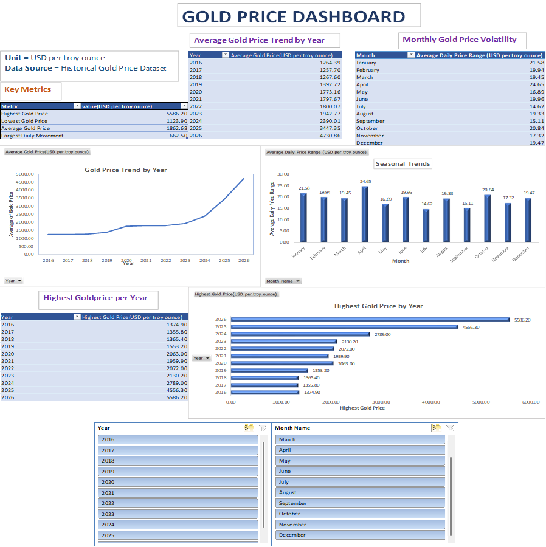

# 📊 Gold Price Trend & Volatility Analysis

## 📌 Project Overview

This project analyzes historical gold prices using Microsoft Excel.

The objective is to identify yearly price trends, monthly volatility,
highest gold prices by year, and seasonal patterns.

An interactive Excel dashboard was created using Pivot Tables,
charts, Power Query, and slicers.

## 🛠️ Tools Used

- Microsoft Excel
- Power Query
- Pivot Tables
- Charts
- Slicers
- Data Visualization

## 🔍 Analysis Performed

- Yearly average gold price trend analysis
- Monthly gold price volatility analysis
- Highest gold price comparison by year
- Seasonal/monthly trend analysis
- Interactive dashboard using slicers

## 📈 Key Insights

- Gold prices remained relatively stable between 2016–2018.
- A steady upward trend became visible after 2019.
- Gold prices crossed $2,000 in 2020.
- A significant increase in gold prices can be observed after 2023.

## 📊 Dashboard

## 📁 Workbook Structure

The Excel workbook contains:

- Raw Data
- Cleaned Data
- Data Analysis
- Data Visualization
- Interactive Dashboard

## 📂 How to Explore

1. Download the Excel workbook.
2. Open the `Dashboard` sheet to view the interactive dashboard.
3. Use the Year and Month Name slicers to filter the visualizations.
4. Explore the Raw Data, Cleaned Data, Data Analysis, and Data Visualization sheets to understand the analysis workflow.

## 🎯 Skills Demonstrated

- Data Cleaning
- Data Analysis
- Microsoft Excel
- Power Query
- Pivot Tables
- Data Visualization
- Dashboard Development
- Analytical Thinking

## 👩‍💻 Author

**Sowmika Kurmana**

Computer Science Engineering – Data Science
